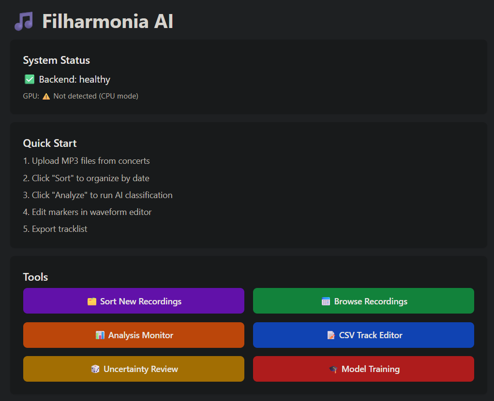
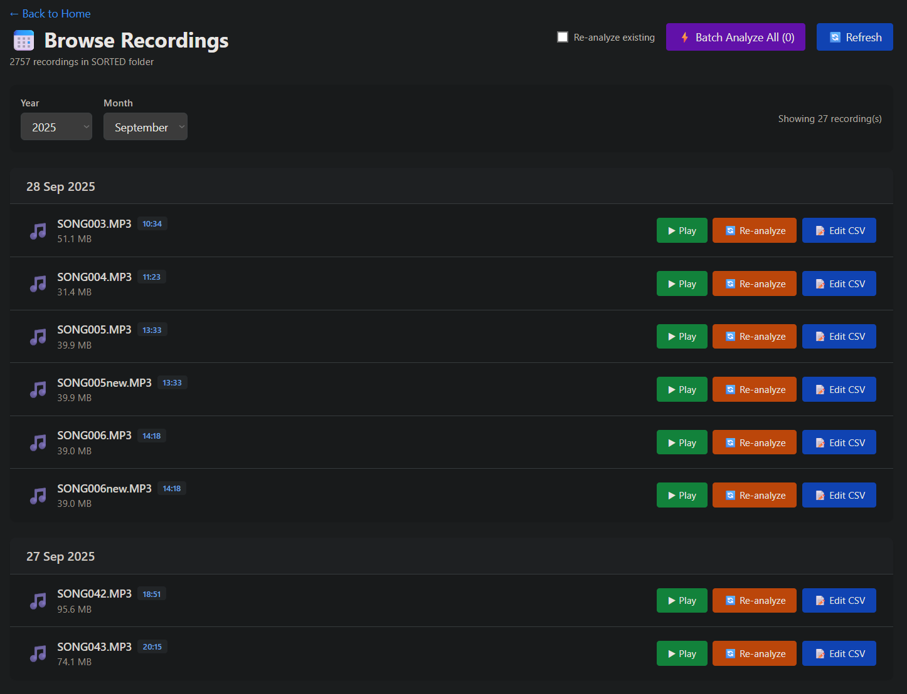
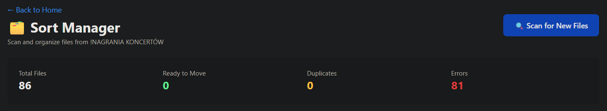
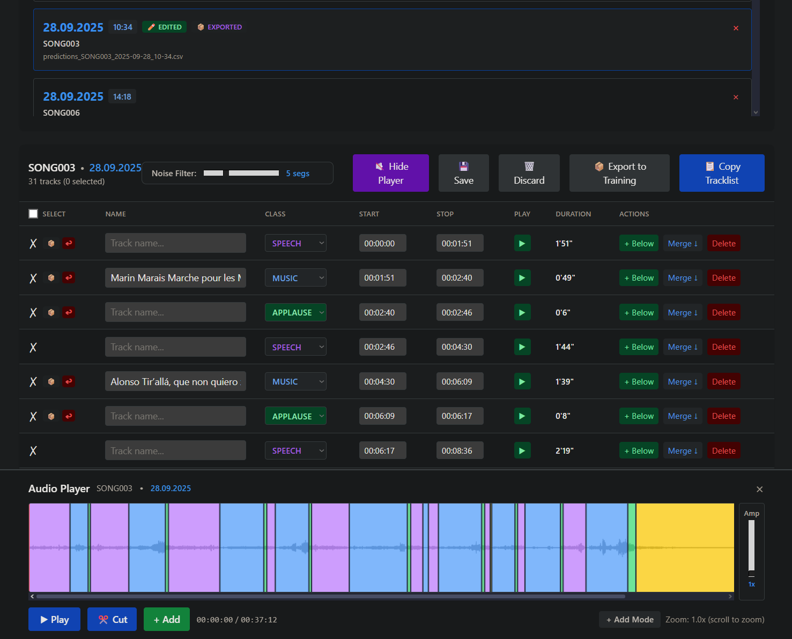
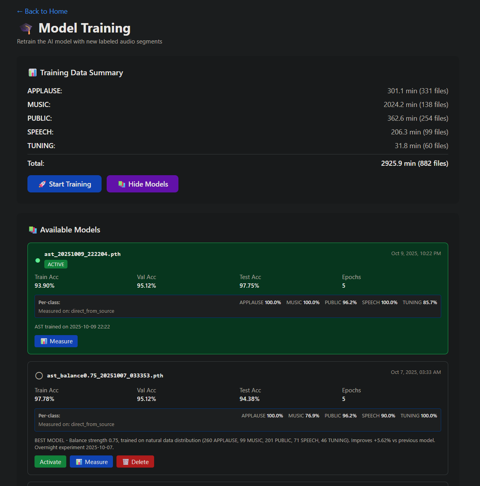

# 🎵 Filharmonia AI

AI-powered concert audio analysis system using **PyTorch Audio Spectrogram Transformer (AST)** for automatic classification and segmentation of philharmonic concert recordings.

## 📋 Features

- **🎼 Audio Classification**: Automatically classifies audio into 5 categories:
  - 🎵 MUSIC - orchestral music
  - 👏 APPLAUSE - audience applause
  - 🗣️ SPEECH - announcements, speeches
  - 👥 PUBLIC - audience noise, intermission
  - 🎻 TUNING - instrument tuning

- **🎨 Visual Waveform Editor**: DAW-style interface for reviewing and correcting predictions
- **🤖 Self-Improving ML Loop**: Export corrected segments → retrain model → improved accuracy
- **📊 Model Management**: Train, compare, and switch between models with measured accuracy
- **📈 Uncertainty Review**: Filter low-confidence predictions for manual review
- **⚡ GPU Accelerated**: CUDA support for fast training and inference

## 📸 Screenshots

### Main Dashboard

*Overview of available models, training data statistics, and recent analyses*

### File Browser & Sorting

*Browse unsorted recordings and organize by date using ID3 tags*


*Automatic sorting of concert recordings by date*

### Waveform Editor

*Visual waveform editor with color-coded segments for each class*


*Edit predictions, adjust boundaries, and export corrected segments*

### Model Management

*Train new models, compare accuracy, and activate best-performing models*

### Uncertainty Review (Active Learning)

*Review low-confidence predictions for manual verification and export*

## 🏗️ Architecture

```
filharmonia-ai/
├── backend/              # FastAPI + PyTorch backend
│   ├── app/
│   │   ├── api/v1/      # REST API endpoints
│   │   ├── services/    # Core business logic
│   │   │   ├── ast_training.py    # Model training service
│   │   │   ├── ast_inference.py   # Model inference service
│   │   │   └── analyze.py         # Audio analysis pipeline
│   │   └── config.py    # Settings and paths
│   ├── pytorch_dataset.py         # Custom PyTorch dataset
│   └── requirements.txt
│
├── frontend/            # React + TypeScript + Vite
│   ├── src/
│   │   ├── components/  # UI components
│   │   ├── pages/       # Page views
│   │   └── api/         # API client
│   └── package.json
│
└── docs/                # Screenshots and documentation
```

## 🚀 Quick Start

### First-Time Installation

Run the automated setup script to install all dependencies:

**Windows:**
```bash
setup.bat
```

**Linux/Mac:**
```bash
chmod +x setup.sh
./setup.sh
```

The setup script will automatically:
- ✅ Check Python and Node.js installation
- ✅ Create Python virtual environment
- ✅ Install PyTorch with CUDA support
- ✅ Install all backend and frontend dependencies
- ✅ Verify installation is complete
- ✅ Create configuration file from template

> **Note:** Don't run `pip install -r requirements.txt` directly - PyTorch CUDA requires special handling which the setup script does automatically.

---

### Running the Application

After installation, start both servers:

**Windows:**
```bash
start.bat
```

**Linux/Mac:**
```bash
./start.sh

# To stop servers:
./stop.sh
```

The application will be available at:
- Frontend: http://localhost:5173
- Backend API: http://localhost:8000

---

### Prerequisites

- **Python 3.11+**
- **Node.js 18+**
- **NVIDIA GPU** (optional but recommended for training)
- **CUDA 12.x** (if using GPU)

### Configuration

After installation, configure your data directory (optional):

1. Edit `.env` file (created by setup script)
2. Set `FILHARMONIA_BASE_DIR` to your desired location
3. If not set, defaults to `project_root/FILHARMONIA_DATA/`

## 📊 Model Training

The system uses **Audio Spectrogram Transformer (AST)** from MIT:
- Pre-trained on AudioSet-10M
- Fine-tuned on concert recordings
- ~86M parameters
- Training time: ~4h on RTX 3080 Ti

**Training new model:**
1. Prepare training data in `TRAINING DATA/DATA/` folder (5 class subfolders)
2. Open web UI → "Training" tab
3. Click "Start Training"
4. Monitor progress in real-time
5. Click "📊 Measure" to evaluate accuracy
6. Click "Activate" to deploy new model

## 🎯 Performance

**Current best model (ast_20251009_222204.pth):**
- Test Accuracy: **97.75%**
- Per-class accuracy:
  - APPLAUSE: 100%
  - MUSIC: 100%
  - PUBLIC: 96.2%
  - SPEECH: 100%
  - TUNING: 85.7%

## 🤖 Pre-trained Model

**Optional:** Download pre-trained model (trained on classical concert recordings):

🤗 **[Hugging Face Model Hub](https://huggingface.co/szymontex/filharmonia-ast)** (recommended)

**Model specs:**
- Architecture: Audio Spectrogram Transformer (MIT/PSLA)
- Test accuracy: 97.75%
- Training data: ~1200 min of classical concert recordings
- Size: 1.03 GB

**Installation:**
1. Download `ast_20251009_222204.pth` from Hugging Face
2. Place in `RECOGNITION_MODELS/ast_active.pth`
3. Start backend and run analysis

**Important:** This model is trained on classical philharmonic concerts. For other music genres (rock, jazz, pop), you'll need to retrain with your own data using the web UI.

## 🔧 Configuration

Edit `backend/app/config.py` to configure:
- Training data paths
- Model save location
- Sample rate & duration
- GPU/CPU device selection

## 📝 Workflow

1. **Sort Recordings**: Organize MP3 files by date using ID3 tags
2. **Analyze**: Process concerts through AST model (~5 min per 1h concert)
3. **Review**: Visual waveform editor for corrections
4. **Export**: Generate tracklists for clients
5. **Train**: Export corrected segments → retrain model → improved accuracy

## 🛠️ Tech Stack

**Backend:**
- FastAPI (REST API)
- PyTorch + torchaudio (ML)
- HuggingFace Transformers (AST model)
- scikit-learn (dataset splitting)

**Frontend:**
- React 18 + TypeScript
- Vite (build tool)
- TanStack Query (data fetching)
- Recharts (visualizations)
- Tailwind CSS (styling)

## 📚 Documentation

- **[Development Guide](docs/DEVELOPMENT.md)** - Setup, architecture, and development workflow
- **[API Reference](docs/API.md)** - Complete REST API documentation

## 🤝 Contributing

Contributions are welcome! Feel free to open issues or submit pull requests.

## 📄 License

MIT License - see LICENSE file for details.

## 🎉 Achievements

- ✅ MVP completed (Oct 2025)
- ✅ Migrated from Keras CNN to PyTorch AST
- ✅ Achieved 97.75% test accuracy
- ✅ Reduced monthly processing time from 4-6h to ~30 min
- ✅ Implemented self-improving ML loop

---

**Last Updated:** December 2025
**Status:** 🚀 Production Ready (MVP)
