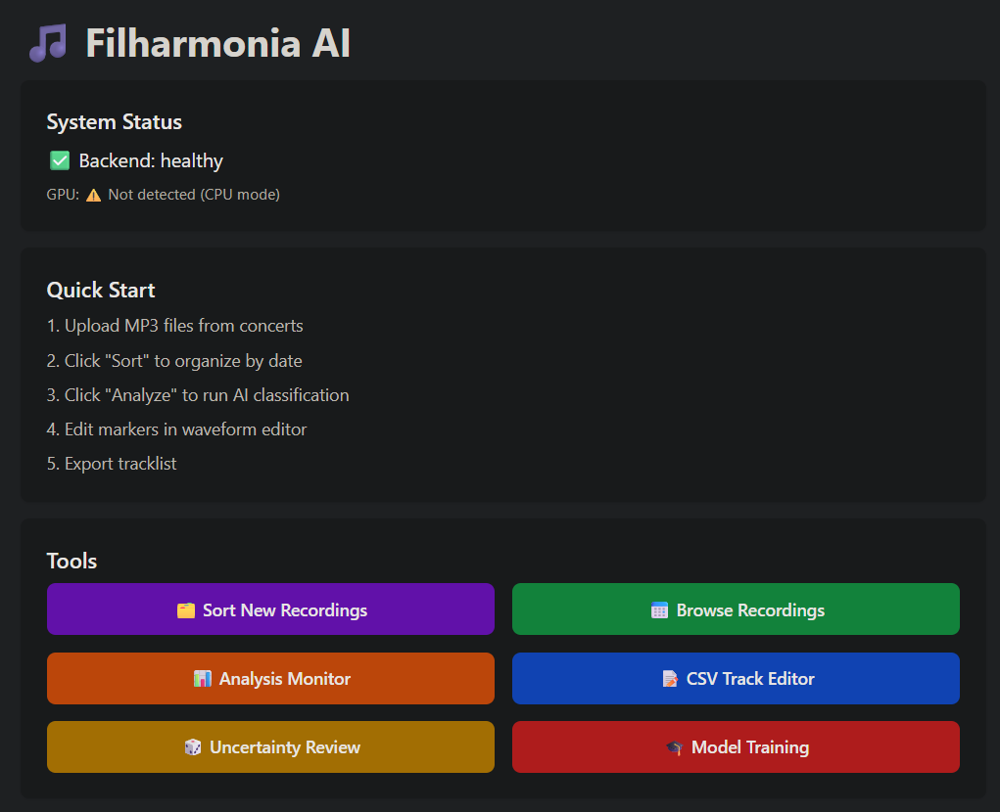
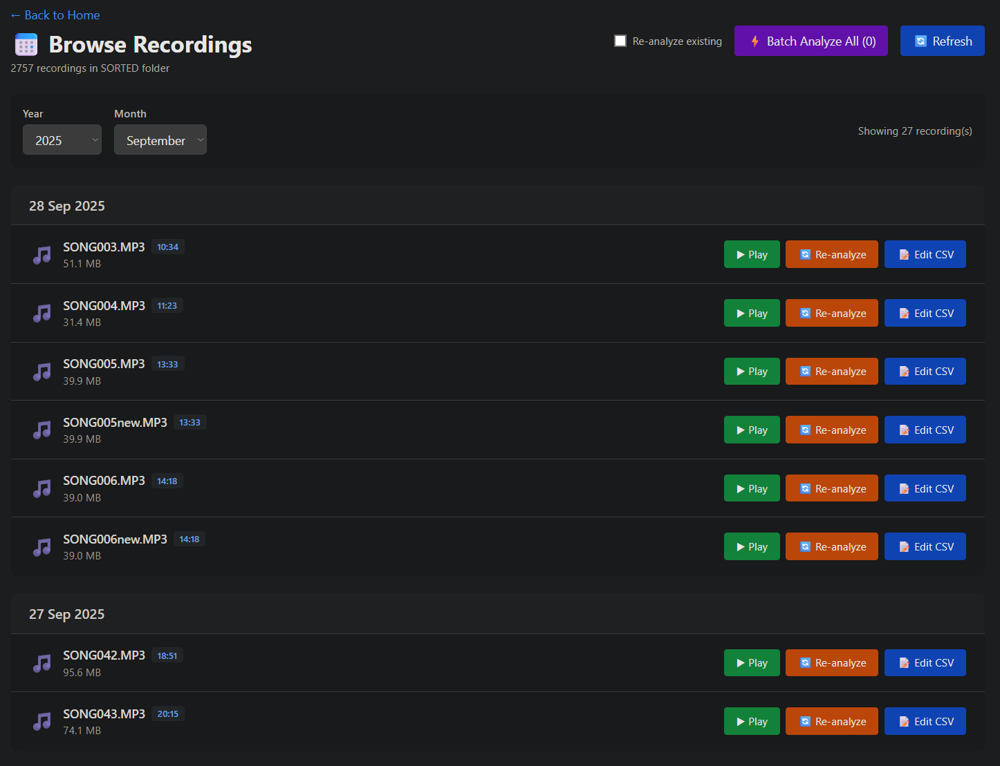
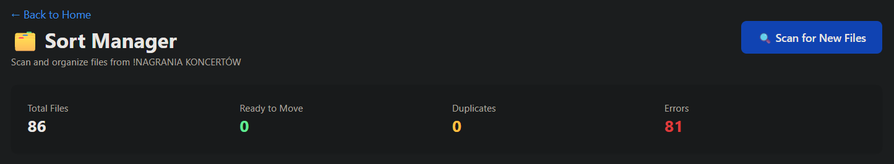
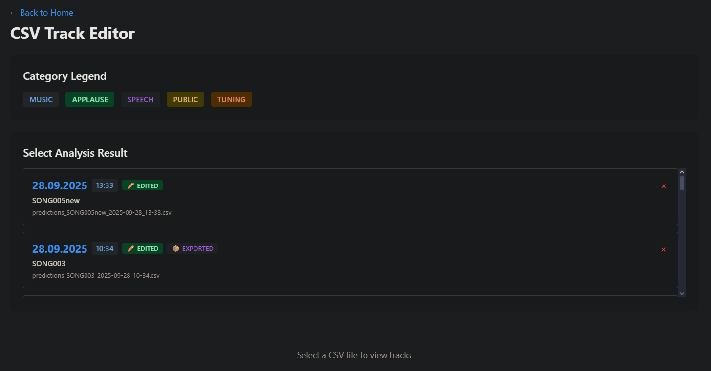
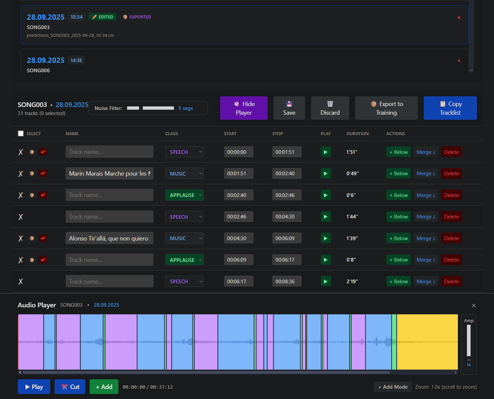
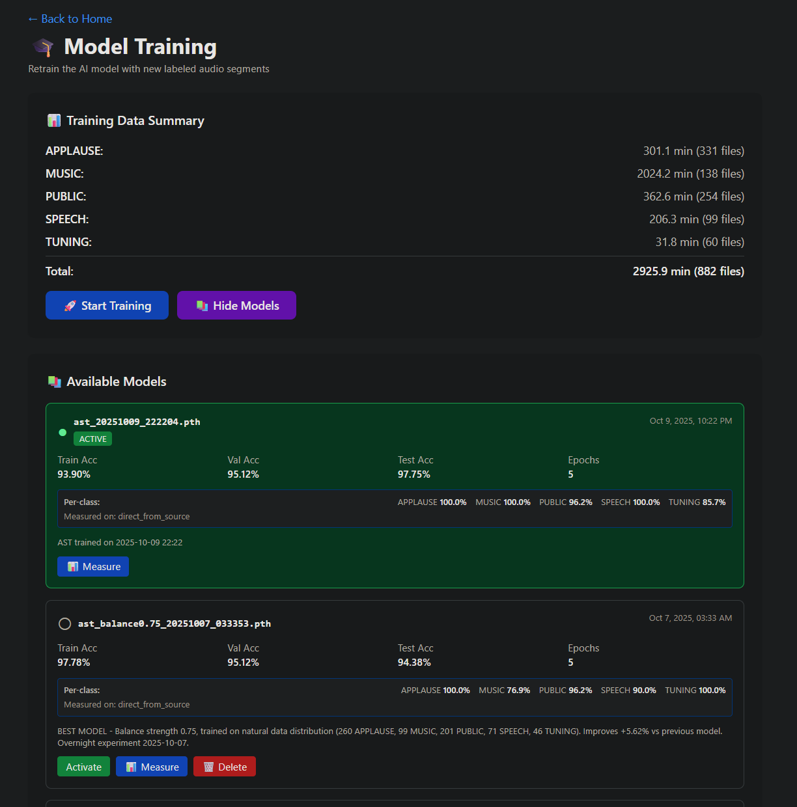
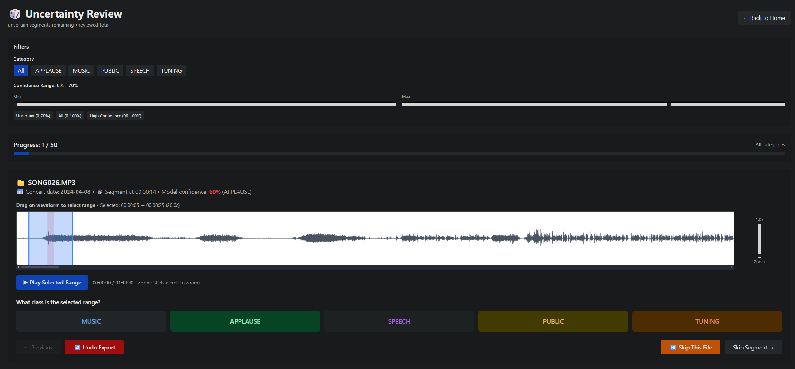

# 🎵 Filharmonia AI

**AI-powered concert audio analysis** using PyTorch Audio Spectrogram Transformer (AST) for automatic classification and segmentation of philharmonic concert recordings.

---

## 🚀 Quick Start (Choose One)

### Option 1: Docker (Easiest - No Setup Required)

```bash
docker-compose up
```

Open http://localhost:5173

Docker handles everything automatically.

---

### Option 2: Local Setup (Windows)

1. **Install Prerequisites:**
   - [Python 3.10+](https://python.org) ✅ Check "Add Python to PATH"
   - [Node.js 18+](https://nodejs.org)

2. **Run Setup (one time):**
   ```
   Double-click: setup.bat
   ```
   Wait 3-5 minutes. Setup auto-detects GPU vs CPU.

3. **Start App:**
   ```
   Double-click: start.bat
   ```
   Opens http://localhost:5173 automatically.

---

### Option 3: Local Setup (macOS / Linux)

1. **Install Prerequisites:**
   ```bash
   # macOS
   brew install python@3.10 node

   # Ubuntu/Linux
   sudo apt install python3.10 python3.10-venv python3-pip
   curl -fsSL https://deb.nodesource.com/setup_20.x | sudo -E bash -
   sudo apt install -y nodejs
   ```

2. **Run Setup (one time):**
   ```bash
   chmod +x setup.sh
   ./setup.sh
   ```
   Wait 3-5 minutes. Setup auto-detects GPU vs CPU.

3. **Start App:**
   ```bash
   ./start.sh
   ```
   Opens http://localhost:5173 automatically.

---

## 📸 Screenshots

### Main Dashboard


### File Browser & Sorting



### Waveform Editor



### Model Management & Uncertainty Review



---

## 📋 Features

### 🎼 Audio Classification
Automatically classifies audio into 5 categories:
- 🎵 **MUSIC** - orchestral music
- 👏 **APPLAUSE** - audience applause
- 🗣️ **SPEECH** - announcements, speeches
- 👥 **PUBLIC** - audience noise, intermission
- 🎻 **TUNING** - instrument tuning

### 🎨 Visual Waveform Editor
DAW-style interface for reviewing and correcting predictions with color-coded segments.

### 🤖 Self-Improving ML Loop
Export corrected segments → retrain model → improved accuracy over time.

### ⚡ Performance Optimization
- **GPU Acceleration**: torch.compile for NVIDIA CUDA (~2x speedup)
- **CPU Optimization**: ONNX INT8 quantization (3x+ speedup vs PyTorch)
- **AMD GPU Support**: ROCm 6.4 with silent fallback detection
- **Auto-Detection**: No manual configuration needed

### 🎹 User Experience
- **Keyboard Shortcuts**: Spacebar (play/pause), 1-5 (classifications), Ctrl+Z/Y (undo/redo), ? (help)
- **Undo/Redo**: Full history for all edits
- **Autosave**: Automatic saving of edits
- **Calendar Browser**: Navigate recordings by date
- **Uncertainty Review**: Filter and review low-confidence predictions

---

## 🛠️ What Gets Installed

### Backend (Python)
- PyTorch 2.5.1 (auto-detects CUDA vs CPU)
- ONNX Runtime for CPU speedup
- FastAPI REST API
- Polars for fast CSV parsing (5-30x faster than pandas)

### Frontend (Node.js)
- React 19 with TypeScript
- Vite dev server
- Modern component architecture

### Models
- **AST Active Model**: 5-class audio classifier
- **ONNX INT8 Model**: Quantized version for CPU (3x+ faster)

**Total Size:** ~2GB
**Setup Time:** 3-5 minutes

---

## 📊 Performance

### Device Detection
At startup, backend logs show what was detected:

**CPU-only (ONNX optimized):**
```
INFO: Device: cpu (CPU)
INFO: Using ONNX INT8 backend (3.2x speedup vs PyTorch CPU)
```

**NVIDIA GPU:**
```
INFO: GPU detected: NVIDIA CUDA 12.1 — GeForce RTX 3090
INFO: Using PyTorch GPU backend with torch.compile
```

**AMD GPU:**
```
INFO: GPU detected: AMD ROCm 6.2 — Radeon RX 7900 XTX
INFO: Using PyTorch GPU backend with torch.compile
```

### Speed Improvements
- **Polars CSV parsing**: 5-30x faster than pandas
- **ONNX INT8 CPU**: 3x+ faster than PyTorch
- **torch.compile GPU**: ~2x speedup vs eager mode
- **Waveform caching**: <500ms repeat load (was 8s)

---

## 🔧 Troubleshooting

### Setup Issues

**"Python not found" (Windows):**
- Reinstall Python with "Add Python to PATH" checked
- Restart terminal after installation

**"Node.js not found":**
- Install from https://nodejs.org
- Restart terminal

**ONNX export fails:**
- Not critical - app uses PyTorch CPU fallback
- Slightly slower but works fine
- Re-run setup to retry

### Runtime Issues

**Backend won't start:**
```bash
# Windows
cd backend
venv\Scripts\activate
python -m uvicorn app.main:app --reload

# macOS/Linux
cd backend
source venv/bin/activate
python -m uvicorn app.main:app --reload
```

**Frontend won't start:**
```bash
cd frontend
pnpm install
pnpm dev
```

**Port already in use:**
- Windows: `netstat -ano | findstr :8000` then `taskkill /PID <PID> /F`
- macOS/Linux: `lsof -ti:8000 | xargs kill -9`

---

## 📁 Project Structure

```
filharmonia-ai/
├── backend/           # FastAPI + PyTorch backend
│   ├── app/          # API routes, services, models
│   ├── scripts/      # ONNX export, utilities
│   └── venv/         # Python virtual environment
├── frontend/         # React 19 frontend
│   ├── src/          # Components, hooks, pages
│   └── node_modules/ # Node.js packages
├── docker/           # Docker configuration
├── setup.bat         # Windows setup script
├── setup.sh          # macOS/Linux setup script
├── start.bat         # Windows start script
├── start.sh          # macOS/Linux start script
└── docker-compose.yml # Docker setup
```

---

## 🐳 Docker Usage

### Development (with hot reload):
```bash
docker-compose up
```

### Production:
```bash
docker build -t filharmonia-ai .
docker run -p 80:80 -v /path/to/audio:/data filharmonia-ai
```

Open http://localhost

---

## 🎯 Usage Workflow

1. **Upload MP3** → Browse local files or use calendar browser
2. **Automatic Analysis** → AST model classifies audio segments
3. **Review Results** → View waveform + predictions
4. **Edit Classifications** → Correct mistakes (undo/redo support)
5. **Export CSV** → Timestamped segment list

### Keyboard Shortcuts
- `Spacebar`: Play/pause audio
- `1-5`: Change segment classification
- `Ctrl+Z`: Undo
- `Ctrl+Y`: Redo
- `Ctrl+S`: Save (autosave already enabled)
- `?`: Show keyboard help

---

## 🌐 API

**Backend:** http://localhost:8000
**Frontend:** http://localhost:5173
**API Docs:** http://localhost:8000/docs

---

## 📚 Documentation

- **docs/ROCM_SETUP.md** - AMD GPU setup guide
- **.planning/** - Development milestones and planning docs

---

## 🏗️ Built With

- **PyTorch** - Deep learning framework
- **Audio Spectrogram Transformer (AST)** - Audio classification model
- **FastAPI** - High-performance Python API
- **React 19** - Modern UI framework
- **Polars** - Fast dataframe library
- **ONNX Runtime** - Cross-platform inference
- **Vite** - Fast frontend tooling

---

## ✨ Recent Updates

### v0.9 - Polish & Stability (2026-01-29)
- ✅ Unified device detection (NVIDIA/AMD/CPU)
- ✅ ONNX INT8 CPU optimization (3x speedup)
- ✅ torch.compile GPU acceleration
- ✅ ROCm 6.4 support for AMD GPUs
- ✅ React 19 upgrade
- ✅ Confidence threshold auto-tuning
- ✅ Cross-platform paths
- ✅ Component refactoring (30% code reduction)
- ✅ Performance improvements (Polars migration)

---

## 📝 License

See LICENSE file in repository root.

---

## 🆘 Support

**Setup Issues:**
1. Check logs: `backend.log` and `frontend.log`
2. Re-run setup script
3. Check troubleshooting section above

**Feature Requests:**
- Create an issue on GitHub

**Need Help:**
- Check documentation in `docs/` folder
- Review API docs at http://localhost:8000/docs
